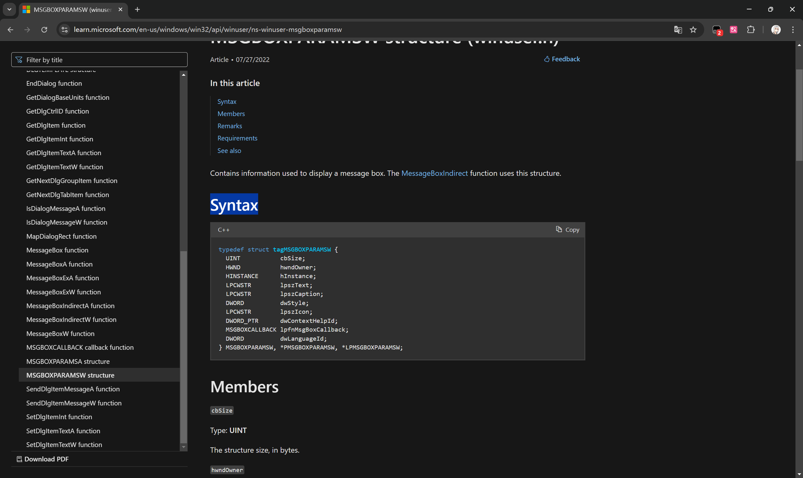

# 构建 YALR

## 需求

- Python3
- 微软的 win32 API 文档 https://learn.microsoft.com/en-us/windows/win32/api/

## 步骤

1. 安装`requirements.txt`中的依赖
2. 从文档中收集所有有必要处理的函数和结构体信息(注意有的是宏) 仅需要`Syntax`部分

3. 粘贴到`input.cpp`中 注意函数/结构体的AW版本必须相邻
4. 运行`codegen.py`生成`yalr.cpp`
5. 如有必要手动编辑`yalr.cpp`

## 问题

- 应该始终检查带有`cbSize`的结构体的大小避免读越界
- 我们暂时不知道如何处理有`out`注解的参数
- 函数/结构体的AW版本必须相邻 只是因为这样解析器好写